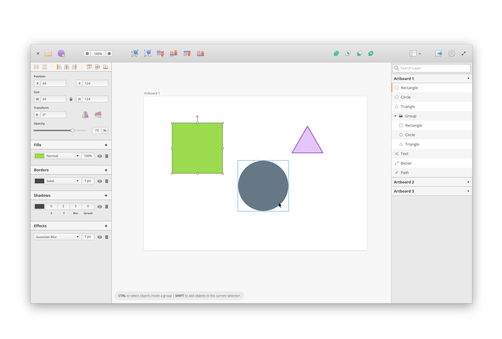

# 
> The Linux Design Tool

[](https://travis-ci.org/akiraux/Akira) [](https://liberapay.com/AkiraUX/)  [](https://www.patreon.com/akiraux)

**AKIRA IS CURRENTLY IN EARLY DEVELOPMENT, NOT READY TO BE USED!**

Akira is a native Linux Design application built in Vala and GTK. Akira focuses on offering a modern and fast approach to UI and UX Design, mainly targeting web designers and graphic designers.
The main goal is to offer a valid and professional solution for designers who want to use Linux as their main OS.



## Get it from the elementary OS AppCenter!
<!--- Akira, is primarly available from the AppCenter for elementary OS. Download it from there! -->
As soon as Akira will reach a more stable version it will be available from the AppCenter for elementary OS.
<!--- [](https://appcenter.elementary.io/com.github.akiraux.akira) -->

## Get it from Flathub!
As soon as Akira will reach a more stable version, an official Flatpack release will be avaialble from FlatHub.

## Get it from the SnapCraft store!
As soon as Akira will reach a more stable version, an official Snap package will be avaialble from SnapCraft store.

## Install it from source
You can install Akira by compiling it from the source, here's the list of dependencies required:
 - `gtk+-3.0>=3.18`
 - `granite>=0.5.0`
 - `glib-2.0`
 - `gee-0.8`
 - `gobject-2.0`
 - `libxml-2.0`
 - `gtksourceview-3.0`
 - `goocanvas-2.0`
 - `cairo`
 - `meson`

**For non-elementary distros, (such as Arch, Debian etc) you are required to install "vala" as additional dependency.**

## Building
```
meson build --prefix=/usr
cd build
ninja && sudo ninja install
```

## Questions and issues
If you want to ask any question about the project, we have a dedicated Discord channel available to any [Patreon](https://www.patreon.com/akiraux) supporter.

If you are trying out Akira and you encounter an error or any problem feel free to just open an issue.

## Donations
If you like Akira and you want to support its development, consider donating via [Liberpay](https://liberapay.com/AkiraUX/) or pledge on [Patreon](https://www.patreon.com/akiraux).

### Official Mascot


**Akari the Cyber Phoenix** is a perfectionist. She is tidy, collected and has a sharp eye for detail. Her name Akari (灯理、) means *"the enlightenment of a sophisticated order"*. Her costume resembles the project's icon.

**License**: GNU GPLv3 / Creative Commons BY-SA
Copyright © 2017 Akira Project.

Get the Mascot and all the other assets from [HERE](https://github.com/akiraux/assets)

Mascot character designed by **Tyson Tan**.
Tyson Tan offers mascot design service for free and open source software, free of charge, under free license.
Contact: [http://tysontan.com](http://tysontan.com)  / [tysontan@mail.com](mailto:tysontan@mail.com)
